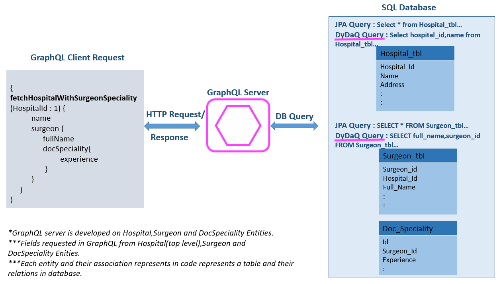

# GraphQL Dynamic Data Query - DyDaQ

 

 **DyDaQ** is a framework which connects GraphQL service layer (resolvers) with database efficiently, it generates highly optimal SQL queries which suits better for GraphQL and makes GraphQL to Database calls lean / high performance. 

Example GraphQL Query:
```json
query{ 
    getHospitalDetails(){
      Name
      Address
      City
      }
    }
``` 
:worried: Traditional JPA Query to DB -> Select * from HospitalDetailsTable;

:blush:   GraphQl Optimized DyDaQ     -> Select _**Name, Address, City**_ from HospitalDetailsTable;

***

#### **DyDaQ -** (**significantly improved query performance vs JPA**)

***

### Features
1. Generates DB SQL queries on the fly dynamically
2. SQL are lean and optimized for GraphQL
3. Support simple queries, complex joins and aggregations
4. Supports Native queries - write your own SQL 
5. Plugin added to generate DTO/POJO (can also use Intellij/Eclipse JPA plugin to generate it)
6. Select only those columns from DB which are requested from GraphQL query

**All these features gives huge performance boost specially with high veracity and high volume data.** 

***


***

### Prerequisite
- Maven 3+
- Java 8+
- Spring framework
- GraphQL-Java
- [GraphQL-Spqr](https://github.com/leangen/graphql-spqr)

***

### Getting Started
Please start with these [Basics and Examples](tutorial/1-0-DyDaQBasics.md) 


#### Steps for implementing Dynamic Query to supercharge your GraphQL Resolvers:

1. Create entities -> [DyDaQ GraphQL DDQ Data Model Entity Generation](tutorial/1-1-ModelEntityGeneration.md) 
2. Generate metadata class from the entities -> [DyDaQ GraphQL DDQ Metadata Class Generation guidelines](tutorial/1-2-MetaClassGeneration.md)
3. Leverage DyDaQ APIs to enable your data -> [DyDaQ GraphQL DDQ Query Development](tutorial/1-3-QueryDevelopment.md)   

##### [Sample Application to Try](graphql-ddq-example/README.md)     
***

### Contributing
We welcome your interest in the American Express Open Source Community on Github. Any Contributor to
any Open Source Project managed by the American Express Open Source Community must accept and sign
an Agreement indicating agreement to the terms below. Except for the rights granted in this 
Agreement to American Express and to recipients of software distributed by American Express, You
reserve all right, title, and interest, if any, in and to Your Contributions. Please
[fill out the Agreement](https://cla-assistant.io/americanexpress/dydaq).

***

### License
Any contributions made under this project will be governed by the
[Apache License 2.0](./LICENSE.txt).

***

### Code of Conduct
This project adheres to the [American Express Community Guidelines](./CODE_OF_CONDUCT.md). 
By participating, you are expected to honor these guidelines.
     