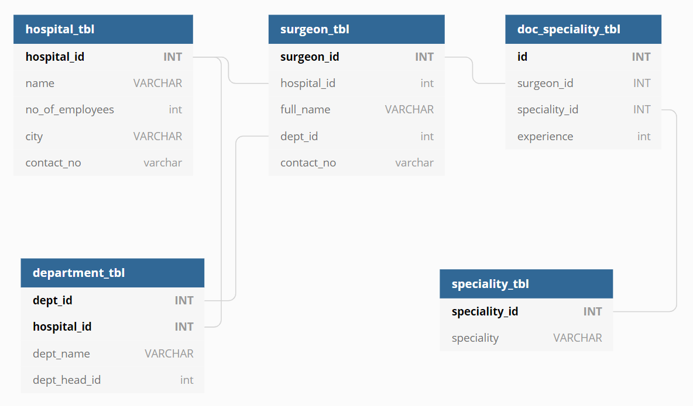
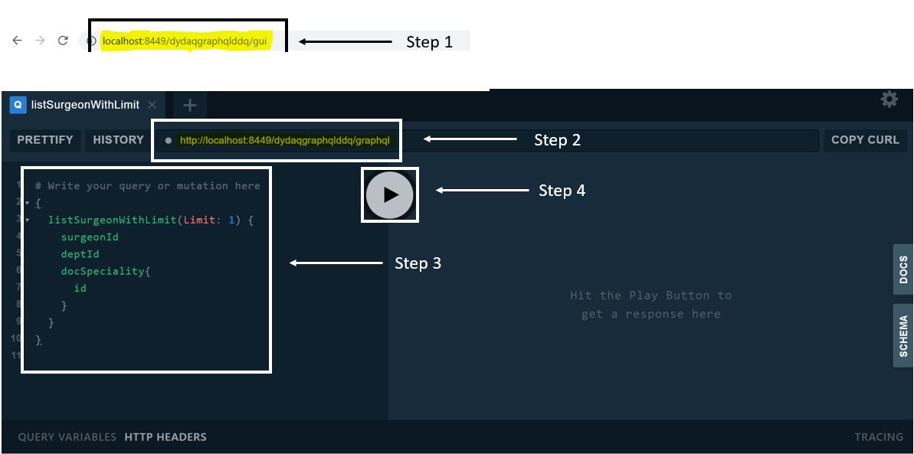

# GraphQL Dynamic Data Query - DyDaQ

**It is a Demo Application developed for a Sample Hospital Management System**

Database Design

#### Steps to Start the application
Start the application please run the Main App: [SampleProjectHospitalManagement.java](src/main/java/com/americanexpress/dydaq/graphql/ddq/dynamicquery/demoproj/SampleProjectHospitalManagement.java) as Spring Boot Application and then follow the below steps : 
1. Once Application is started, open url [http://localhost:8449/dydaqgraphqlddq/gui](http://localhost:8449/dydaqgraphqlddq/gui) in your browser.
2. And add the url http://localhost:8449/dydaqgraphqlddq/graphql in the inner placeholder as shown in the below image.
3. Add any valid query in the left pane.
4. Hit the button to execute the query.

Please refer to below diagram :

Below are some valid Queries which you can try out : 

1.  { fetchHospitalWithSurgeonSpeciality(HospitalId:1001) {name surgeon { fullName docSpeciality { experience } }}}
2.  { fetchHospitalWithSurgeonSpeciality(HospitalId:1001) { surgeon { fullName docSpeciality { experience } }}}
3.  { fetchHospitalWithSurgeonSpecialityTwoQuerys(HospitalId:1001) {name surgeon { fullName docSpeciality { experience } }}}
4.  { listSurgeonWithOrderByContactNo {fullName contactNo}}
5.  { hospitalWithMaxEmployee {hospitalId name noOfEmployees city contactNo}}
6.  { countHospitalByCity{city hospitalCount}}  

You can check the code implementation for different Query Builder below :
1.  [SimpleQueryBuilder](src/main/java/com/americanexpress/dydaq/graphql/ddq/dynamicquery/demoproj/resolver/SimpleQueryResolver.java)
2.  [JoinQueryBuilder](src/main/java/com/americanexpress/dydaq/graphql/ddq/dynamicquery/demoproj/resolver/JoinQueryResolver.java) 
3.  [NativeQueryBuilder](src/main/java/com/americanexpress/dydaq/graphql/ddq/dynamicquery/demoproj/resolver/NativeQueryTestResolver.java)