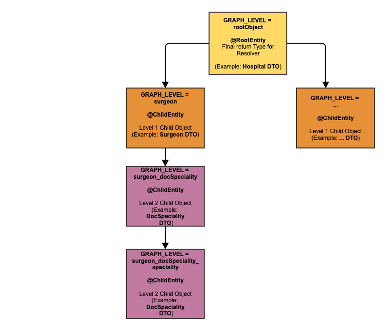
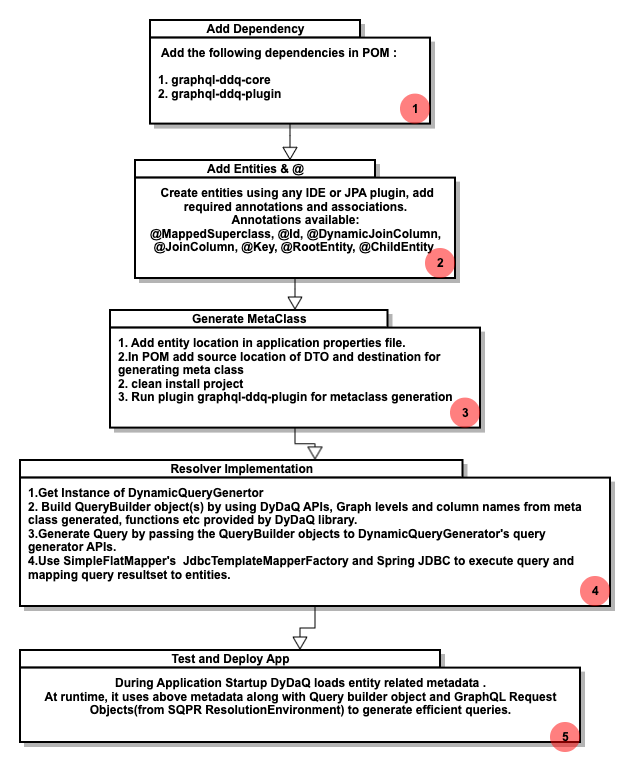

 

### DyDaQ Basics

* DyDaQ creates a graphical/hierarchical structure of pojo entities to build the SQL queries
* We start with having a root entity which is a parent/root level pojo
* API uses below 6 constructs to generate efficient queries dynamically 
* These constructs define top level entity, child entity and their relationship, on which columns joins will be performed, if the column needs to be eagerly fetched on which other queries are dependent (@DynamicJoinColumn)

 

***

### DyDaQ Constructs

1.  **RootEntity**  **:**  All the entities which are returned directly by graphql resolver must be annotated with `@RootEntity`.
2.  **ChildEntity**  **:**  All the entities which are referred by other entity must be annotated with `@ChildEntity` if they are not root entity.
3.  **DynamicJoinColumn :** In case you are using JoinQueryBuilder, annotate all the foreign keys with` @DynamicJoinColumn` - defines which column joins would happen
4.  **RootKey :** In case of building joined query using _NativeQueryBuilder or JoinQueryBuilder_, RootKey is the graph key of the top level entity into which whole query (formed by query builder) result set will be added.
5.  **GraphKey :**  In case of building simple query using _SimpleQueryBuilder / NativeQueryBuilder_, GraphKey is the graph level of the entity/object to be built using the query builder
6.  **Key :** All the primary keys needs to be annotated with @Key from org.simpleflatmapper.map.annotation.Key (See Example App included). Alternatively you can add the keys using addKeys method in ResultSetExecuter while setting the jdbc resultset into entity using SimpleFlatMapper. These Ids are used by Simpleflatmapper to map your query generated into the existing entities with proper nesting of objects.

***

### How it all connects:

