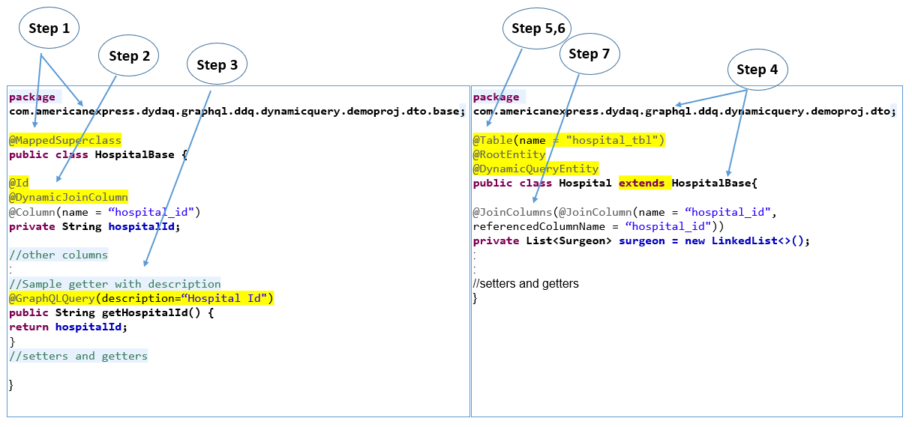

 

### Data Model and Entity Generation

* **For entity/pojo generation, DyDaQ uses opensource project jpa-entity-generator is being used. You can alternatively use any _Intellij/Eclipse JPA plugins_ to generate the same**
​
* For entity generation using [jpa-entity-generator](https://github.com/smartnews/jpa-entity-generator),follow the steps mentioned in its page.
​
* Remove @Entity and @Table annotations and annotate the entities as @MappedSuperClass

* For JoinQueryBuilder, where you want to provide associations based on columns between entities so that JoinQueryBuilder picks up and add as join conditions while generating query, please add the columns with @DynamicJoinColumns.

* Annotate the primary key @Key or you can add the key columns in ResultSetExecutors(check examples) using addKeys(keyNames...).These keys are used by SimpleFlatMapper while mapping result set to entities ​

With the above steps entity MappedSuperClass is generated which has all the columns of the table for which entity needs to be created. MappedSuperClass can be extended to give a concrete implementation of the table. Multiple implementations can  be provided based on different association requirements.  
​​​
***

### Step by Step Implementation of Entities for DyDaQ

Generate data model in java as per JPA standard while following the below steps : 
​

**Step 1.**  Place the data model in "base" package inside "dto" package and and annotate it with @MappedSuperclass.
​
**Step 2.** Annotate columns which are primary keys or which will be used in where columns or are foreign key with @DynamicJoinColumn.
​
**Step 3.** For adding metadata about the columns,add @GraphQLQuery(description=" add column description") in the getters of the fields.
​
**Step 4.** Extend MappedSuperClass and place it in parent package of base ie.. dto package.

**Step 5.** If the extended class is return type of the resolver being developed,annotate it with @RootEntity as it is also at root level in case the object is nested. 

**Step 6.** Annotate the extended class with @ChildEntity if this entity is being referred by any other entity and is not a root entity.

**Step 7** Add @Table with table name(not needed for native query building feature of Dynamic Query) on the entities.​

**Step 8.** Create associations with other entities.For using Join Query Building feature of Dynamic Query, add join conditions using @JoinColumns.

