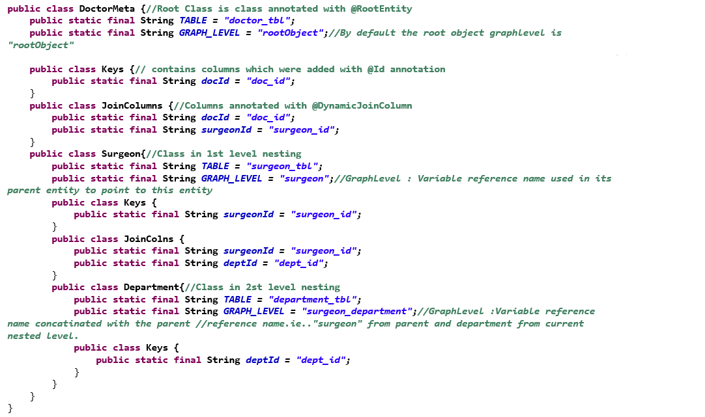

 

### Metadata Class Generation

sample Metadata class generated based on the Root Entity Doctor:



* For dynamic query generations, we need to pass the graph levels, and columns to be used for joining graphs.
* Graph Levels are the different pojo/entity levels in the request payload from which fields are requested. They follow some specific naming conventions. 
* Metadata Generator provides us utility to generate these Graph levels constant class and the columns names on basis of which we are joining the tables/graphs. 

***

1. Declare root entities by adding annotation @RootEntity to the entity class which you want to keep as root object of the entity/create a join table.  

2. Add the plugin **graphql-ddq-plugin** with other supporting tags as below for dynamic query Meta Class Generation and change source(Dynamic Query Entity package) and destination(destination for Meta data class) package:

```xml
<build>  
    <resources>
        <resource>
            <directory>src/main/resources</directory>
        </resource>
    </resources>
    <!-- Plugin for Dynamic Query meta data generation --> 
    <plugins>
        <plugin>
            <groupId>com.americanexpress.dydaq</groupId>
            <artifactId>graphql-ddq-plugin</artifactId>
            <version>1.0.0</version>
            <configuration>
              <sourcePackage>com.americanexpress.dydaq.datagraph.dto</sourcePackage>
              <!--for creating meta constant files for specific class provide class name inside sourceclassList tag as below else don't add the tag and all classes will be processed-->
              <sourceClassList>Surgeon.java,Hospital.java</sourceClassList>
              <destinationPackage>com.americanexpress.dydaq.datagraph.util</destinationPackage>
            </configuration>
            <goals>
              <goal>graphql-ddq-dquery</goal>
            </goals>
        </plugin>
        <plugin>
            <groupId>org.springframework.boot</groupId>
            <artifactId>spring-boot-maven-plugin</artifactId>
                <executions>
                    <execution>
                        <goals>
                            <goal>repackage</goal>
                        </goals>
                        <!--: Comment this after DDQ Plugin execution: Begin-->
                        <configuration>
                            <classifier>exec</classifier>
                        </configuration>
                        <!--: END-->
                    </execution>
                </executions>
        </plugin>
    </plugins>
</build>
```

3. Remove entity and table related annotations and annotate the entities as @MappedSuperClass.
​
With the above steps entity MappedSuperClass is generated which has all the columns of the table for which entity needs to be created. MappedSuperClass be extended to give a concrete implementation of the table. Multiple implementations can  be provided based on different association requirements.  
​
​
4. For Generating Metadata class run below maven command (Ignore Warning) and confirm the destination package has the required class generated.If you want to generate Meta class for few files only,you can provide the classes inside sourceClassList tag.
​
    `mvn install graphql-ddq-plugin`
​
5. Metadata class will be generated in the location mentioned in the destinationPackage by reading the root entities from the source package.

***

**How to use Meta classes**

Suppose you have below class hierarchy : 

```java
@RootEntity
public class Hospital extends HospitalBase{
    Surgeon surgeon;
    //setter and getter
}

@ChildEntity​
public class Surgeon extends SurgeonBase{
    Speciality speciality;
    //setter getters
}
```
​
Once using above 5 steps the Meta files are generated (with "Meta" appended in the root entity in destination folder) and we should be able to access the constants as below : 

1. For accessing graph level of Root entity : 

String graphLevelForRootEntity = HospitalMeta.GRAPH_LEVEL;

2. For accessing graphlevel of child entity Surgeon inside Hospital entity: 

String graphLevelForSurgeonEntity = HospitalMeta.Surgeon.GRAPH_LEVEL

3. For accessing columns of HospitalEntity : 

String columnNameOfHospitalEntity = HospitalMeta.AllColumns.{COLUMN_NAME}

Similarly Columns annotated as @DynamicJoinColumns can be accessed via JoinColumn inner class and Columns annotated with Ids can be accessed via Keys class.

 